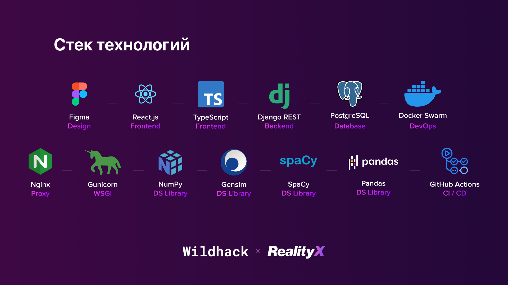
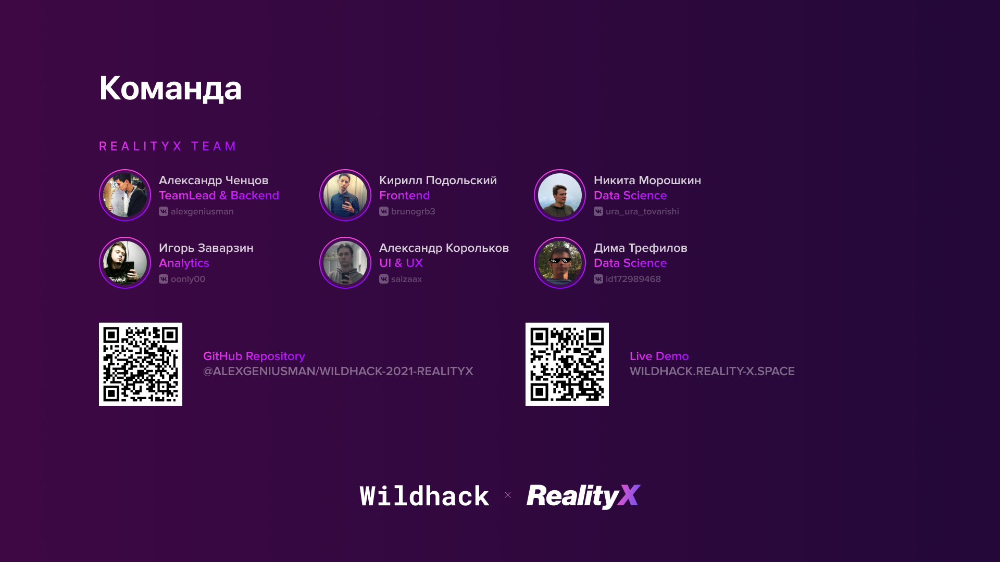

# Hello, this is WildHack-2021 by RealityX

## 🧭 Contents:

* [🗒️ Description](#description)
* [🧱 Stack](#stack)
* [➡️ Launching](#launching)
* [👨‍💻 Team](#team)
* [📇 Contacts](#contacts)

<a name="description"></a>

## 🗒️ Description

Web service with an effective algorithm for selecting hints that reduce the user's time to search for the right product
in the search bar of the marketplace

<a name="stack"></a>

## 🧱 Stack



<a name="launching"></a>

## ➡️ Launching

1. At first install:

- [Git](https://git-scm.com/book/en/v2/Getting-Started-Installing-Git)
- [Docker](https://docs.docker.com/get-docker/)
- [Docker Compose](https://docs.docker.com/compose/install/)

2. Clone project:

```
git clone https://github.com/AlexGeniusMan/WildHack-2021-RealityX wildhack
cd wildhack
git submodule init
git submodule update
```

3. Create .env file and add secrets to it:

```
PROXY_PORT=YOUR_PROXY_PORT
FRONTEND_API_URL=YOUR_PROTOCOL://YOUR_SERVICE_DOMAIN_NAME:YOUR_PROXY_PORT/

BACKEND_DEBUG_MODE=False
BACKEND_SECRET_KEY=YOUR_BACKEND_SECRET_KEY
BACKEND_ALLOWED_HOSTS="backend YOUR_SERVICE_DOMAIN_NAME"

BACKEND_SUPERUSER_USERNAME=YOUR_BACKEND_SUPERUSER_USERNAME
BACKEND_SUPERUSER_EMAIL=YOUR_BACKEND_SUPERUSER_EMAIL
BACKEND_SUPERUSER_PASSWORD=YOUR_BACKEND_SUPERUSER_PASSWORD

BACKEND_DEFAULT_DB=PostgreSQL
DB_NAME=YOUR_DB_NAME
DB_USER=YOUR_DB_USER
DB_PASSWORD=YOUR_DB_PASSWORD
```

> - To generate new BACKEND_SECRET_KEY use [this](https://stackoverflow.com/a/57678930/14355198) instruction
> - BACKEND_ALLOWED_HOSTS must be a list of allowed hosts, separated by whitespaces. To see how to configure it, look at [this](https://docs.djangoproject.com/en/3.2/ref/settings/#allowed-hosts) instruction

4. Launch with Docker Compose:

```
docker-compose -f docker-compose.override.yml up --build
```

> Done! Project launched.


<a name="team"></a>

## 👨‍💻 Team

This project was made by RealityX - team of [RTUITLab](https://rtuitlab.dev/)



<a name="contacts"></a>

## 📇 Contacts

Any suggestions for improvement? Want to offer cooperation? Write us:

- Vk: https://vk.com/alexgeniusman
- Tg: https://t.me/alexgeniusman
- Email: alexgeniusman@reality-x.space
